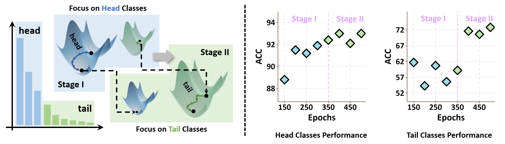

# SSE-SAM: Balancing Head and Tail Classes Gradually through Stage-Wise SAM

Xingyu Lyu, Qianqian Xu, Zhiyong Yang, Shaojie Lyu, Qingming Huang

---

This is the official implementation of "SSE-SAM: Balancing Head and Tail Classes Gradually through Stage-Wise SAM"[[arXiv](https://arxiv.org/abs/2412.13715)] (Accepted by AAAI 2025).

## Abstract



Real-world datasets often exhibit a long-tailed distribution, where vast majority of classes known as tail classes have only few samples. Traditional methods tend to overfit on these tail classes. Recently, a new approach called Imbalanced SAM (ImbSAM) is proposed to leverage the generalization benefits of Sharpness-Aware Minimization (SAM) for long-tailed distributions. The main strategy is to merely enhance the smoothness of the loss function for tail classes. However, we argue that improving generalization in long-tail scenarios requires a careful balance between head and tail classes. We show that neither SAM nor ImbSAM alone can fully achieve this balance. For SAM, we prove that although it enhances the model's generalization ability by  escaping saddle point in the overall loss landscape, it does not effectively address this for tail-class losses. Conversely, while ImbSAM is more effective at avoiding saddle points in tail classes, the head classes are trained insufficiently, resulting in significant performance drops. Based on these insights, we propose Stage-wise Saddle Escaping SAM (SSE-SAM), which uses complementary strengths of ImbSAM and SAM in a phased approach. Initially, SSE-SAM follows the majority sample to avoid saddle points of the head-class loss. During the later phase, it focuses on tail-classes to help them escape saddle points. Our experiments confirm that SSE-SAM has better ability in escaping saddles both on head and tail classes, and shows performance improvements.

## Requirements

- torch 2.4.1
- torchvision 0.19.1
- scikit-learn 1.3.2
- tensorflow 2.14.0
- timm 1.0.11
- numpy==1.24.4
- pandas==2.0.3
- matplotlib 3.7.5
- tqdm==4.66.6

Run `pip install -r requirements.txt` to install the required dependencies.

## Datasets

The `train.py` will automatically download the CIFAR100/CIFAR10 datasets into `./datasets` dir.

## Training

Sample command to train on CIFAR-100 LT dataset with CE + SSE-SAM:

``` shell
python scripts/train.py \
    --gpu 0 \
    --imb_factor 100 \
    --opt ssesam \
    --loss CE \
    --eta 100 \
    --print_freq 1 \
    --head_rho 0.05 \
    --tail_rho 0.10 \
    --gamma 0.70 \
    --dataset cifar100 \
```

## Overview of the Arguments

Below are the key arguments used in this project:

- `--dataset`: Dataset `(cifar10|cifar100)`.
- `--eta`: Class size threshold to split head and tail classes.
- `--gpu`: GPU id to use.
- `--imb_factor`: Imbalance Factor, Ratio of samples in the minority class to majority class.
- `--loss`: Loss type `(CE|LDAM|VA|VS)`.
- `--opt`: Optimizer `(sgd|sam|imbsam|ssesam)`.
- `--rho`: Hyperparameter $\rho$ in SAM and ImbSAM.
- `--head_rho`: Hyperparameter $\rho_{\text{head}}$ in SSE-SAM.
- `--tail_rho`: Hyperparameter $\rho_{\text{tail}}$ in SSE-SAM.
- `--gamma`: Hyperparameter $\gamma$ in SSE-SAM specifying stage transition.

## Usage of `SSESAM` Optimizer

Our SSE-SAM optimizer is included in `ssesam.py`. Example usage:

``` python
from ssesam import SSESAM

model = MyModel()

...

if optim_mode == 'ssesam':
    # Identify tail samples using their class labels
    tail_mask = torch.where((targets[:, None] == tail_classes[None, :].to(targets.device)).sum(1) == 1, True, False)

    # Compute and backpropagate head loss
    logits = model(images)
    head_loss = lossFunc(logits[~tail_mask], targets[~tail_mask]).sum() / targets.size(0)
    head_loss.backward(retain_graph=True)
    optimizer.compute_and_add_epsilon(n_i=0)  # Perturb for head classes

    # Recompute logits for head classes and calculate updated gradients
    logits = model(images)
    head_loss = lossFunc(logits[~tail_mask], targets[~tail_mask]).sum() / targets.size(0)
    head_loss.backward(retain_graph=True)
    optimizer.compute_grad_sum_and_restore_p()  # Accumulate and restore head gradients

    # Compute and backpropagate tail loss
    logits = model(images)
    tail_loss = lossFunc(logits[tail_mask], targets[tail_mask]).sum() / targets.size(0)
    tail_loss.backward(retain_graph=True)
    optimizer.compute_and_add_epsilon(n_i=1)  # Perturb for tail classes

    # Recompute logits for tail classes and calculate updated gradients
    logits = model(images)
    tail_loss = lossFunc(logits[tail_mask], targets[tail_mask]).sum() / targets.size(0)
    tail_loss.backward(retain_graph=True)
    optimizer.compute_grad_sum_and_restore_p()  # Accumulate and restore tail gradients

    # Update model parameters
    optimizer.update()

    # Combine head and tail losses
    loss = head_loss + tail_loss
```

- **Parameters**

| Parameter   | Type                      | Description                                                                                       |
|------------------|-------------------------------|-------------------------------------------------------------------------------------------------------|
| `optimizer`     | `torch.optim.Optimizer`       | A PyTorch optimizer instance, such as `SGD`, which performs the underlying optimization.    |
| `model`         | `torch.nn.Module`            | The neural network model whose parameters will be optimized.                                         |
| `head_rho`      | `float`                       | The $\rho$ parameter for the head classes, controlling the magnitude of SAM perturbation on head classes.          |
| `tail_rho`      | `float`                       | The $\rho$ parameter for the tail classes, controlling the magnitude of SAM perturbation on tail classes.          |
| `gamma`         | `float`, optional (default=0) | Fraction of training epochs after which `head_rho` will decay to 0. Must satisfy $0 \leq \gamma < 1$. |
| `total_epochs`  | `int`, optional (default=200) | Total number of training epochs, used in conjunction with `gamma` to determine decay timing.         |

---

- **Methods**

| Method                     | Description                                                                                              |
|--------------------------------|--------------------------------------------------------------------------------------------------------------|
| `compute_and_add_epsilon(n_i)` | Computes the perturbation $\epsilon$ for the specified class type (`head` or `tail`) and updates parameters.|
| `compute_grad_sum_and_restore_p()` | Accumulates gradients and restores model parameters by removing applied perturbations.                         |
| `update()`                     | Performs the optimization step using accumulated gradients and clears the internal state.                    |
| `update_rho()`                 | Dynamically updates the `head_rho` value to 0 after the specified cut-off epoch (`gamma * total_epochs`).     |

## Results on CIFAR100-LT (IF=100)

| Method      | Many | Med  | Few  | Avg  |
|-------------|------|------|------|------|
| CE          |   74.3   |   43.1   |   11.6   |   44.6   |
| +SAM        | **75.3** |   45.6   |   12.9   |   46.2   |
| +ImbSAM     |   72.3   |   50.4   |   16.6   |   47.9   |
| +SSE-SAM    |   71.7   | **54.5** | **17.1** | **49.3** |

## Acknowledgement

Our implementation is based on the [ImbSAM](https://github.com/cool-xuan/Imbalanced_SAM). We also extend our thanks to [LDAM](https://github.com/kaidic/LDAM-DRW) for their imbalanced dataset generation code and code implementation of LDAM loss, and [VS](https://github.com/orparask/VS-Loss) for their code implementation of VS loss. We thank the authors for making their code publicly.

## Citation

If you find our paper and code useful, please cite us as

```
@inproceedings{lyu2025ssesam,
  title = {SSE-SAM: Balancing Head and Tail Classes Gradually through Stage-Wise SAM},
  author = {Lyu, Xingyu and Xu, Qianqian and Yang, Zhiyong and Lyu, Shaojie and Huang, Qingming},
  booktitle = {AAAI Conference on Artificial Intelligence},
  year = {2025}
}
```
